# Handbuch: Die Adminseite der Minecraft-Server

Auf der **Adminseite** verwalten Schülerinnen und Schüler ihren eigenen Minecraft-Server – ganz ohne PuTTY und FileZilla. Lehrkräfte vergeben dort die Server und behalten den Überblick.

Dieses Handbuch erklärt die Bedienung Schritt für Schritt. Die Einrichtung auf dem Server (Installation, Mailversand, HTTPS) steht in der [README](README.md#admin-page).

## Inhalt

- [Auf einen Blick](#auf-einen-blick)
- [Teil 1 – Für Lehrkräfte](#teil-1--für-lehrkräfte)
  - [Erster Zugang](#erster-zugang)
  - [Anmelden](#anmelden)
  - [Die Übersicht](#die-übersicht)
  - [Einen Server vergeben](#einen-server-vergeben)
  - [Einen Server freigeben und zurücksetzen](#einen-server-freigeben-und-zurücksetzen)
  - [Zugänge verwalten](#zugänge-verwalten)
  - [Letzte Aktionen](#letzte-aktionen)
  - [Jeden Server bedienen – auch die Lobby](#jeden-server-bedienen--auch-die-lobby)
- [Teil 2 – Den eigenen Server bedienen](#teil-2--den-eigenen-server-bedienen)
  - [Einladung annehmen und anmelden](#einladung-annehmen-und-anmelden)
  - [Starten, stoppen, neu starten](#starten-stoppen-neu-starten)
  - [Plugins](#plugins)
  - [Spieler und Operatoren](#spieler-und-operatoren)
  - [Einstellungen (server.properties)](#einstellungen-serverproperties)
- [Häufige Fragen](#häufige-fragen)

---

## Auf einen Blick

| | Schülerin / Schüler | Lehrkraft (Admin) |
|---|---|---|
| Sieht | nur den eigenen Server | alle Server und alle Zugänge |
| Server starten, stoppen, neu starten | ✓ | ✓ (jeden Server) |
| Plugins installieren, hochladen, entfernen | ✓ | ✓ |
| Spieler hinzufügen, Operatoren festlegen | ✓ | ✓ |
| Einstellungen (`server.properties`) ändern | ✓ | ✓ |
| Server vergeben, freigeben, zurücksetzen | – | ✓ |
| Zugänge einladen und löschen | – | ✓ |

**Anmeldung in zwei Schritten:** Mailadresse und Passwort, danach ein 6-stelliger **Code**, der jedes Mal an die Mailadresse geschickt wird. Wer nur das Passwort kennt, kommt also nicht hinein.

---

## Teil 1 – Für Lehrkräfte

### Erster Zugang

Den allerersten Admin-Zugang legt die Person an, die den Server betreibt (`adminctl invite-admin`, siehe README). Weitere Lehrkräfte laden Sie später selbst ein ([Zugänge verwalten](#zugänge-verwalten)).

Sie bekommen eine Mail **„Einladung zur Minecraft-Adminseite“**:

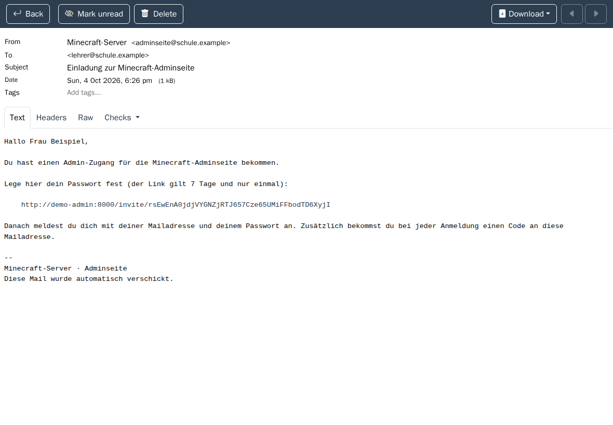

Der Link gilt **7 Tage** und **nur einmal**. Er öffnet eine Seite, auf der Sie Ihr Passwort festlegen (mindestens 8 Zeichen – nehmen Sie nicht das Passwort Ihres Mailkontos):

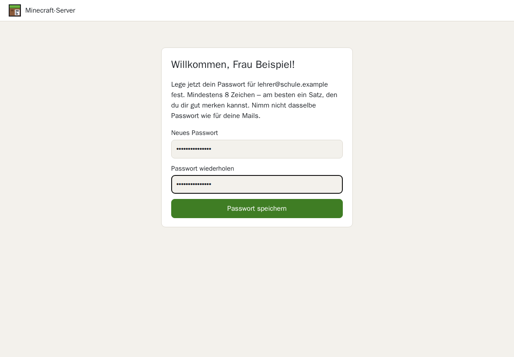

### Anmelden

1. Mailadresse und Passwort eingeben, **Weiter** klicken.

   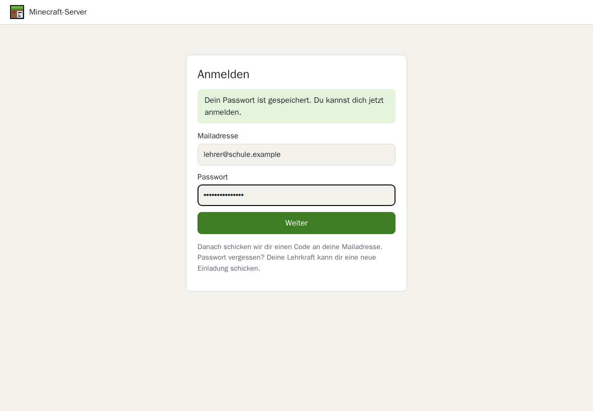

2. In Ihrem Postfach liegt jetzt eine Mail **„Dein Anmeldecode: …“**. Den 6-stelligen Code eingeben und **Anmelden** klicken.

   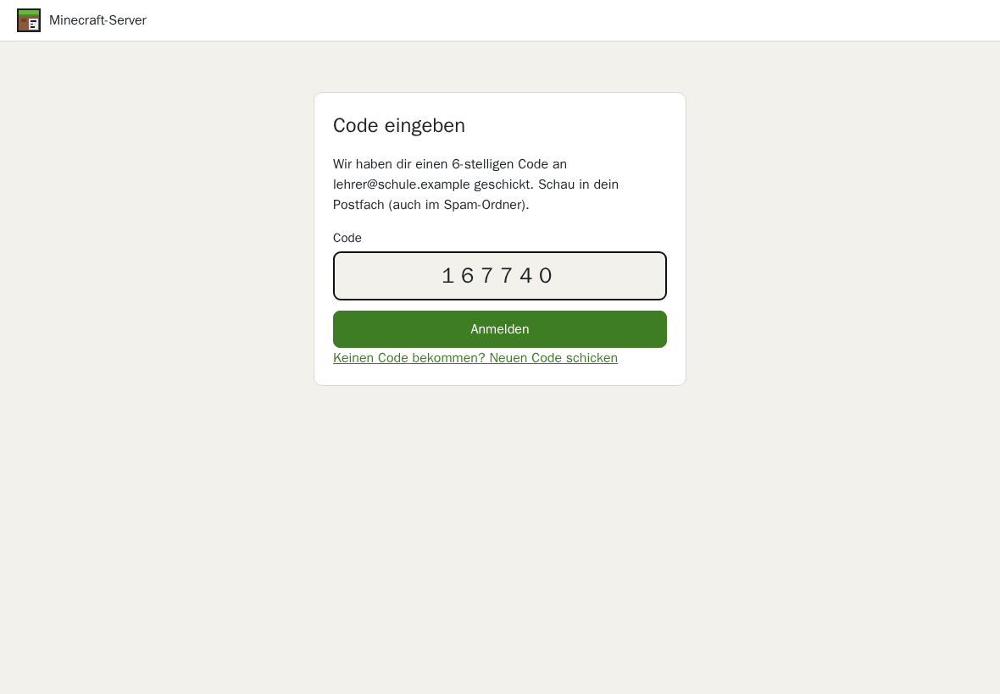

- Der Code gilt **10 Minuten**. Nach 5 falschen Versuchen beginnt die Anmeldung von vorn.
- Keine Mail bekommen? Spam-Ordner prüfen oder **Neuen Code schicken** anklicken.
- Nach **2 Stunden** ohne Aktivität (spätestens nach 12 Stunden) werden Sie automatisch abgemeldet. Auf gemeinsam genutzten Rechnern bitte immer **Abmelden** (oben rechts).

### Die Übersicht

Nach der Anmeldung sehen Lehrkräfte die **Übersicht**:

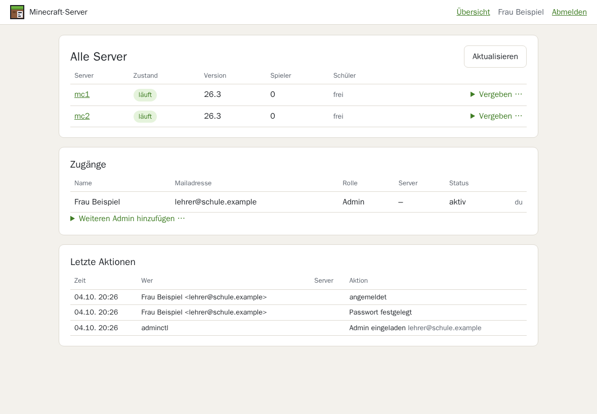

- **Alle Server** – Zustand, Minecraft-Version, Spieler online und wem der Server gehört. Ein Klick auf den Servernamen öffnet ihn.
- **Zugänge** – alle Lehrkräfte und Schüler mit Rolle, Server und Status („aktiv“ oder „Einladung offen“).
- **Letzte Aktionen** – wer wann was getan hat.

Mit **Aktualisieren** holen Sie den neuesten Stand der Server.

| Zustand | Bedeutung |
|---|---|
| läuft | Der Server ist an, man kann sich verbinden. |
| startet … | Der Server fährt gerade hoch (etwa 30 Sekunden). |
| wird gebaut … | Eine neue Minecraft-Version wird erstellt – das kann einige Minuten dauern. |
| gestoppt | Der Server wurde ausgeschaltet und wartet auf „Starten“. |
| nicht erreichbar | Der Container läuft nicht oder antwortet nicht – siehe [Häufige Fragen](#häufige-fragen). |

### Einen Server vergeben

1. Neben einem **freien** Server auf **Vergeben …** klicken.
2. **Name** und **Mailadresse** der Schülerin oder des Schülers eingeben.
3. **Vergeben und einladen** klicken.

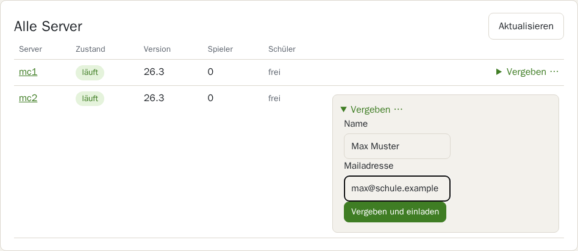

Die Schülerin oder der Schüler bekommt sofort eine Einladungsmail und legt damit ein eigenes Passwort fest. Sie müssen sich also keine Passwörter ausdenken oder verteilen. In der Übersicht steht bis dahin „Einladung offen“:

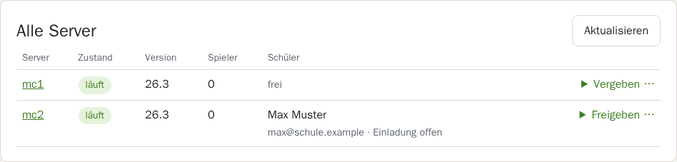

Jede Person kann höchstens **einen** Server haben. Hat jemand schon einen Zugang ohne Server (z. B. aus dem letzten Workshop), wird er mit derselben Mailadresse wieder verwendet.

### Einen Server freigeben und zurücksetzen

Wenn ein Workshop zu Ende ist oder ein Server an jemand anderen gehen soll: neben dem Server auf **Freigeben …** klicken.

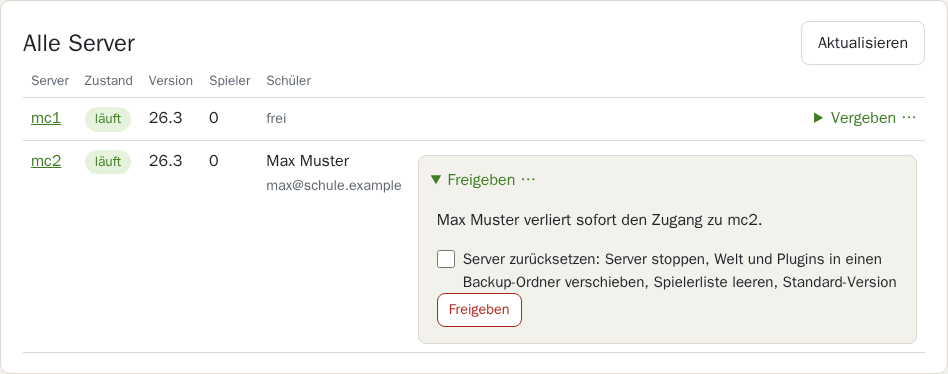

- **Ohne Häkchen:** Die Schülerin oder der Schüler verliert **sofort** den Zugang (auch wenn gerade jemand angemeldet ist). Welt, Plugins und Spielerliste bleiben, wie sie sind.
- **Mit Häkchen „Server zurücksetzen“:** zusätzlich wird der Server für die nächste Person vorbereitet:
  - der Server wird gestoppt,
  - Welt und Plugins werden in einen Backup-Ordner verschoben (nicht gelöscht; die drei neuesten Backups bleiben erhalten),
  - Whitelist und Operatoren werden geleert, die Minecraft-Version geht auf den Standard zurück,
  - beim nächsten Start werden die Standard-Plugins neu installiert.

Danach ist der Server wieder **frei** und kann neu vergeben werden.

### Zugänge verwalten

In der Tabelle **Zugänge** finden Sie bei jeder Person unter **Mehr …**:

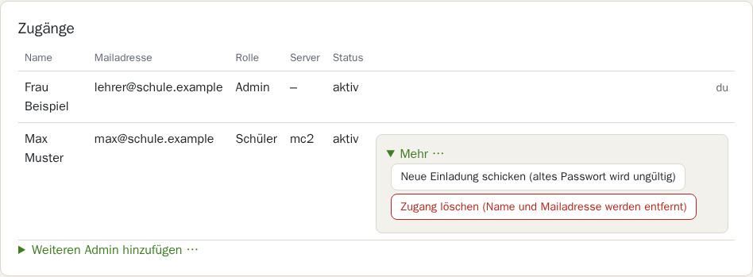

- **Neue Einladung schicken** – so funktioniert „Passwort vergessen“: Das alte Passwort wird sofort ungültig, und die Person legt mit dem Link in der neuen Mail ein neues fest.
- **Zugang löschen** – Name und Mailadresse werden vollständig entfernt (auch aus den letzten Aktionen). Gedacht für das Ende eines Schuljahrs oder wenn jemand nicht mehr teilnimmt.

Mit **Weiteren Admin hinzufügen …** laden Sie andere Lehrkräfte ein. Den eigenen Zugang und den letzten Admin-Zugang kann man nicht löschen.

### Letzte Aktionen

Hier steht, wer wann was gemacht hat – zum Beispiel wenn ein Server plötzlich anders aussieht:

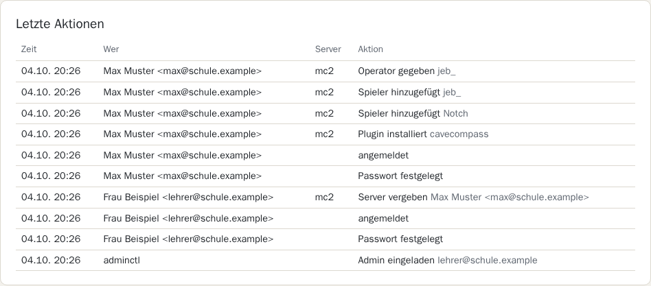

### Jeden Server bedienen – auch die Lobby

Lehrkräfte können **jeden** Server öffnen (Klick auf den Namen in der Übersicht) und dort alles tun, was auch die Schülerinnen und Schüler können – siehe [Teil 2](#teil-2--den-eigenen-server-bedienen). Oben steht, wem der Server gehört:

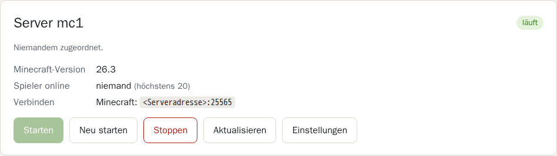

Im **BungeeCord-Modus** erscheint zusätzlich die **Lobby** (der Server, auf dem alle Spieler zuerst landen). Sie ist mit „nur Admins“ gekennzeichnet: Sie kann nicht vergeben und nicht zurückgesetzt werden, Lehrkräfte können sie aber starten, stoppen und Plugins und Einstellungen ändern.

---

## Teil 2 – Den eigenen Server bedienen

Dieser Teil gilt für Schülerinnen und Schüler – und für Lehrkräfte, wenn sie einen Server öffnen.

### Einladung annehmen und anmelden

Du bekommst eine Mail **„Einladung zur Minecraft-Adminseite“**. Klicke auf den Link, lege ein Passwort fest und melde dich an – genau wie bei den Lehrkräften beschrieben: [Erster Zugang](#erster-zugang) und [Anmelden](#anmelden). Nach der Anmeldung landest du direkt bei deinem Server.

### Starten, stoppen, neu starten

| Knopf | Was passiert |
|---|---|
| **Starten** | Der Server fährt hoch – nach etwa 30 Sekunden kannst du dich verbinden. |
| **Neu starten** | Der Server speichert die Welt, fährt herunter und wieder hoch. Nötig, damit neue Plugins oder Einstellungen wirken. |
| **Stoppen** | Der Server speichert die Welt und bleibt aus, bis jemand **Starten** drückt. |
| **Aktualisieren** | Lädt die Seite neu, z. B. um zu sehen, ob der Server schon läuft. |
| **Einstellungen** | Öffnet die [Einstellungen](#einstellungen-serverproperties). |

Unter **Verbinden** steht, wie du in Minecraft auf deinen Server kommst – entweder eine Adresse mit Port oder „Über die Lobby, dann `/server mc…`“.

### Plugins

Plugins sind Erweiterungen für den Server, z. B. neue Befehle oder Spiele.

**Installierte Plugins** stehen oben in der Tabelle. Mit **Entfernen** wirfst du eines hinaus. Plugins mit **Pflicht** werden für die Technik gebraucht und lassen sich nicht entfernen.

**Aus dem Katalog installieren:** Der Katalog ist nach Themen geordnet und hat einen eigenen Bereich, den du nach unten **scrollen** kannst:

- **Installieren** klicken – fertig. Braucht ein Plugin ein anderes, steht das unter „Installiert dazu“ und es wird automatisch mitinstalliert (z. B. Multiverse-Portals bringt Multiverse-Core mit).
- **Testphase** heißt: Das Plugin läuft auf dem Server, ist aber noch wenig erprobt.
- „Nicht für Minecraft … verfügbar“ heißt: Dieses Plugin gibt es für die Version deines Servers nicht.
- Wechselt die Minecraft-Version deines Servers, werden die Katalog-Plugins beim nächsten Start automatisch auf die passende Version umgestellt.

Nach dem Installieren erscheint ein Hinweis:

**Wichtig:** Ein neues oder entferntes Plugin wirkt erst nach **Neu starten**.

**Eigenes Plugin hochladen:** Unter „Eigenes Plugin hochladen“ eine `.jar`-Datei auswählen und **Hochladen** klicken (höchstens 64 MB). Es muss ein Spigot-Plugin sein. Gibt es schon ein Plugin mit demselben Namen, wird es ersetzt. *(Die Beschriftung des Auswahlknopfs – „Datei auswählen“ oder „Choose File“ – hängt von der Sprache deines Browsers ab.)*

### Spieler und Operatoren

Auf deinen Server dürfen nur Spieler, die auf der **Whitelist** stehen.

- **Spieler hinzufügen:** Minecraft-Namen eingeben (3–16 Zeichen: Buchstaben, Ziffern, `_`) und **Spieler hinzufügen** klicken. Das wirkt **sofort**, ohne Neustart.
- **Zum Operator machen:** Operatoren dürfen alle Befehle benutzen (z. B. `/gamemode`). Gib diese Rechte nur Leuten, denen du vertraust.
- **Entfernen:** Der Spieler darf nicht mehr auf den Server und verliert auch die Operator-Rechte.

### Einstellungen (server.properties)

Unter **Einstellungen** änderst du die Datei `server.properties` – zum Beispiel Spielmodus, Schwierigkeit oder den Text in der Serverliste.

1. Den gewünschten Wert ändern, z. B. `difficulty=easy` zu `difficulty=hard`.
2. **Speichern und neu starten** klicken (bei einem gestoppten Server heißt der Knopf **Speichern und starten**). Minecraft liest die Datei nur beim Start.

- **Nur speichern** speichert, ohne neu zu starten – die Änderung wirkt dann beim nächsten Start.
- **Änderungen verwerfen** lädt die Datei neu, ohne zu speichern.
- **Letzte gespeicherte Änderung rückgängig machen** holt die Fassung von vor dem letzten Speichern zurück.
- Einige Einträge, die der Server zum Funktionieren braucht (`server-port`, `online-mode`, alles mit `rcon`), bleiben immer unverändert – auch wenn du sie änderst.

Unter dem Textfeld steht eine Erklärung der wichtigsten Einträge:

---

## Häufige Fragen

**Der Code kommt nicht an.**
Spam-Ordner prüfen. Mit **Neuen Code schicken** kommt ein neuer – höchstens 5 Codes in 15 Minuten. Kommt gar nichts, Bescheid sagen: Dann stimmt etwas mit dem Mailversand nicht.

**Ich habe mein Passwort vergessen.**
Die Lehrkraft schickt dir unter *Zugänge → Mehr … → Neue Einladung schicken* eine neue Einladung. Damit legst du ein neues Passwort fest.

**„Zu viele Fehlversuche. Bitte warte 15 Minuten.“**
Nach zu vielen falschen Passwörtern wird die Anmeldung kurz gesperrt. Nach 15 Minuten geht es wieder.

**Mein Server ist „nicht erreichbar“.**
Kurz warten und **Aktualisieren** – nach einem Neustart dauert es etwas. Bleibt es dabei, muss die Lehrkraft bzw. die Person, die den Server betreibt, nachsehen (`docker compose ps`).

**Ich habe ein Plugin installiert, aber es tut nichts.**
Den Server **neu starten** – Plugins werden nur beim Start geladen.

**Mein Freund kommt nicht auf den Server.**
- Steht er auf der Spielerliste? Den Minecraft-Namen genau so schreiben, wie er im Spiel heißt.
- Hat er eine ältere Minecraft-Version? Dann **ViaBackwards** aus dem Katalog installieren und neu starten. Bei einer neueren Version hilft **ViaVersion**.

**Ich habe in den Einstellungen etwas kaputt gemacht.**
In den Einstellungen auf **Letzte gespeicherte Änderung rückgängig machen** klicken und neu starten.

**Ist meine Welt weg, wenn der Server gestoppt wird?**
Nein. Beim Stoppen und Neustarten wird die Welt gespeichert. Nur **Freigeben mit „Server zurücksetzen“** räumt die Welt weg – und auch dann liegt sie noch im Backup-Ordner des Servers.
