# Handbuch für Schülerinnen und Schüler: Dein Minecraft-Server

Du hast einen eigenen Minecraft-Server bekommen. Auf der **Adminseite** kannst du ihn starten und stoppen, Plugins installieren, festlegen, wer mitspielen darf, und seine Einstellungen ändern – alles im Browser.

*Für Lehrkräfte gibt es ein eigenes Handbuch: [admin-handbuch.md](admin-handbuch.md).*

## Inhalt

- [Los geht's: Einladung und Anmeldung](#los-gehts-einladung-und-anmeldung)
- [Dein Server: starten, stoppen, neu starten](#dein-server-starten-stoppen-neu-starten)
- [Plugins](#plugins)
- [Spieler und Operatoren](#spieler-und-operatoren)
- [Einstellungen (server.properties)](#einstellungen-serverproperties)
- [Sicher bleiben](#sicher-bleiben)
- [Häufige Fragen](#häufige-fragen)

---

## Los geht's: Einladung und Anmeldung

### 1. Die Einladung

Deine Lehrkraft gibt dir einen Server. Dann bekommst du eine Mail **„Einladung zur Minecraft-Adminseite“**. Darin steht, welcher Server dir gehört, und ein Link:

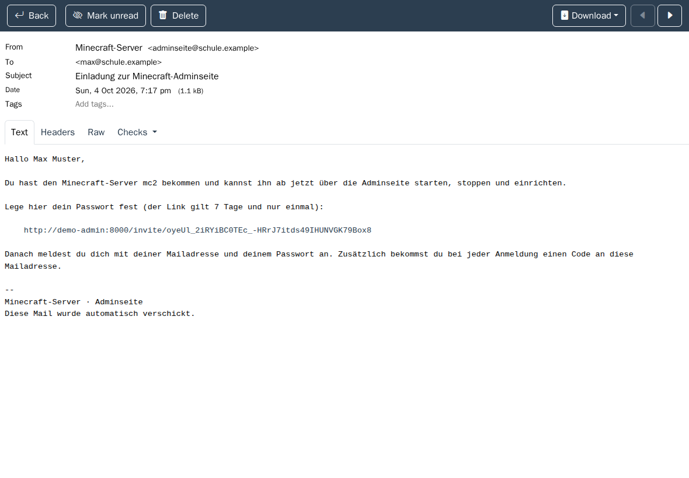

Der Link gilt **7 Tage** und **nur einmal**.

### 2. Dein Passwort festlegen

Der Link öffnet diese Seite. Denk dir ein Passwort mit **mindestens 8 Zeichen** aus – am besten einen kurzen Satz, den du dir gut merken kannst – und gib es zweimal ein:

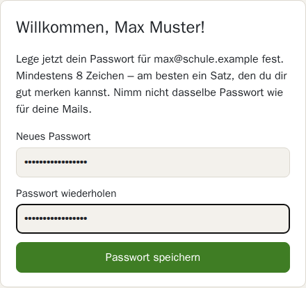

**Nimm nicht dasselbe Passwort wie für dein Mail-Postfach.**

### 3. Anmelden

Gib deine **Mailadresse** und dein **Passwort** ein und klicke **Weiter**:

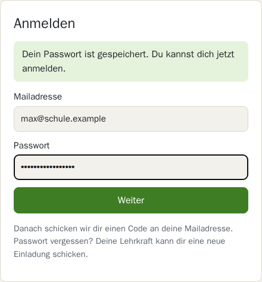

### 4. Den Code eingeben

Jetzt bekommst du eine zweite Mail **„Dein Anmeldecode: …“** mit einem **6-stelligen Code**. Tippe ihn ein und klicke **Anmelden**:

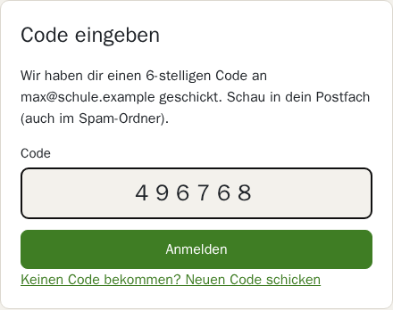

- Der Code gilt **10 Minuten**.
- Keine Mail da? Schau im **Spam-Ordner** nach oder klicke **Neuen Code schicken**.
- Warum zwei Schritte? Selbst wenn jemand dein Passwort errät, kommt er ohne den Code aus deinem Postfach nicht hinein.

Danach landest du direkt bei deinem Server.

---

## Dein Server: starten, stoppen, neu starten

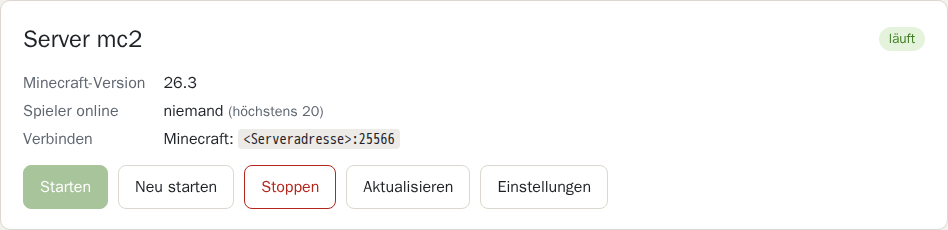

Oben rechts siehst du, was dein Server gerade macht:

| Zustand | Bedeutung |
|---|---|
| läuft | Der Server ist an – du kannst dich verbinden. |
| startet … | Er fährt gerade hoch. Warte etwa 30 Sekunden. |
| wird gebaut … | Eine neue Minecraft-Version wird erstellt. Das kann ein paar Minuten dauern. |
| gestoppt | Der Server ist aus. Klicke **Starten**. |
| nicht erreichbar | Der Server antwortet gerade nicht – siehe [Häufige Fragen](#häufige-fragen). |

Und das machen die Knöpfe:

| Knopf | Was passiert |
|---|---|
| **Starten** | Der Server fährt hoch. Nach etwa 30 Sekunden kannst du dich verbinden. |
| **Neu starten** | Der Server speichert die Welt, fährt herunter und wieder hoch. Das brauchst du, damit neue Plugins oder Einstellungen wirken. |
| **Stoppen** | Der Server speichert die Welt und bleibt aus, bis du **Starten** drückst. |
| **Aktualisieren** | Lädt die Seite neu – z. B. um zu sehen, ob der Server schon läuft. |
| **Einstellungen** | Öffnet die [Einstellungen](#einstellungen-serverproperties). |

**Verbinden:** Unter „Verbinden“ steht, wie du in Minecraft auf deinen Server kommst – entweder eine Adresse mit Port (`<Serveradresse>:25566`) oder „Über die Lobby, dann `/server mc…`“. Die Serveradresse sagt dir deine Lehrkraft.

---

## Plugins

Plugins sind Erweiterungen für deinen Server – zum Beispiel neue Befehle, Welten oder Spiele.

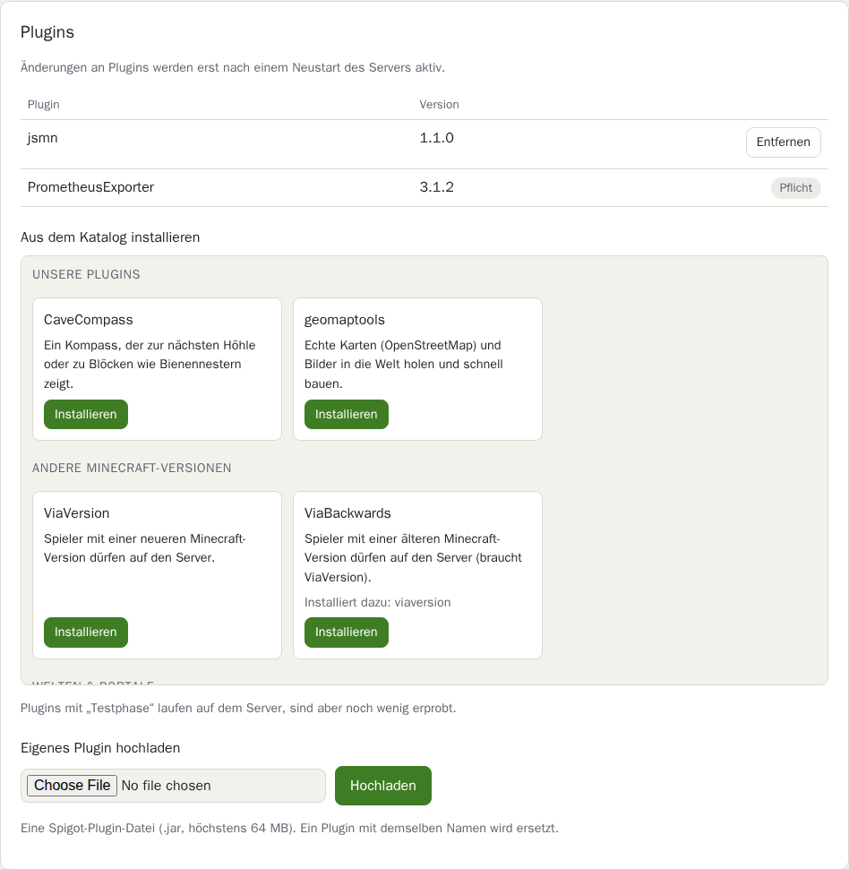

### Installierte Plugins

Oben in der Tabelle stehen die Plugins, die schon auf deinem Server sind. Mit **Entfernen** wirfst du eines hinaus. Plugins mit **Pflicht** braucht die Technik – die kannst du nicht entfernen.

### Aus dem Katalog installieren

Der Katalog ist nach Themen geordnet und hat einen eigenen Bereich, den du nach unten **scrollen** kannst:

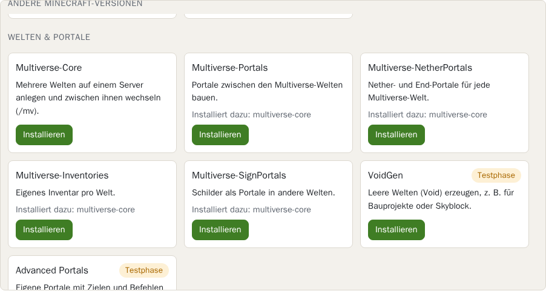

- Klicke beim gewünschten Plugin auf **Installieren**.
- Braucht ein Plugin ein anderes, steht das unter **„Installiert dazu“** – es wird automatisch mitinstalliert.
- **Testphase** heißt: Das Plugin läuft, ist aber noch wenig erprobt. Probier es aus und sag Bescheid, wenn etwas nicht klappt.
- **„Nicht für Minecraft … verfügbar“** heißt: Für die Version deines Servers gibt es dieses Plugin nicht.

Danach erscheint dieser Hinweis:

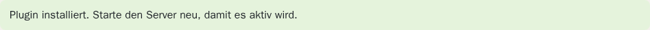

**Wichtig:** Ein neues oder entferntes Plugin wirkt erst, wenn du den Server **neu startest**.

### Eigenes Plugin hochladen

Du hast selbst ein Plugin gebaut oder eine `.jar`-Datei aus dem Internet?

1. Unter **„Eigenes Plugin hochladen“** die Datei auswählen. *(Der Knopf heißt je nach Browser „Datei auswählen“ oder „Choose File“.)*
2. **Hochladen** klicken.
3. Den Server **neu starten**.

Die Datei darf höchstens 64 MB groß sein und muss ein Spigot-Plugin sein. Gibt es schon ein Plugin mit demselben Namen, wird es ersetzt.

---

## Spieler und Operatoren

Mit der **Spielerliste** (Whitelist) legst du fest, wer auf deinen Server darf.

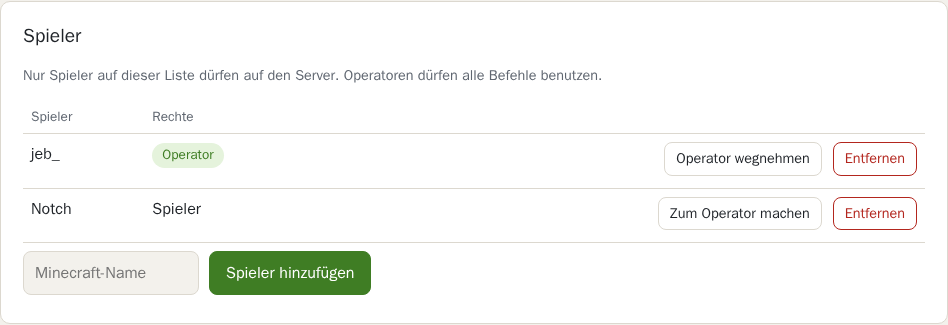

**Die Spielerliste wirkt erst, wenn sie eingeschaltet ist.** Bei einem neuen Server ist sie **aus** – dann darf jeder auf den Server, der die Adresse kennt, und die Seite zeigt einen roten Hinweis. So schaltest du sie ein:

1. Zuerst **dich selbst** und deine Freunde als Spieler hinzufügen (sonst sperrst du dich aus).
2. In den [Einstellungen](#einstellungen-serverproperties) die Zeile `white-list=false` zu `white-list=true` ändern.
3. **Speichern und neu starten** klicken.

Danach steht über der Liste „Die Spielerliste ist eingeschaltet“.

- **Spieler hinzufügen:** Den Minecraft-Namen genau so eintippen, wie er im Spiel heißt (3–16 Zeichen: Buchstaben, Ziffern, `_`), dann **Spieler hinzufügen**. Das wirkt **sofort**.
- **Zum Operator machen:** Operatoren dürfen alle Befehle benutzen, zum Beispiel `/gamemode creative` oder `/time set day`. Gib diese Rechte nur Leuten, denen du vertraust – sie können auch deine Welt verändern.
- **Operator wegnehmen:** Der Spieler darf weiter mitspielen, aber keine Befehle mehr benutzen.
- **Entfernen:** Der Spieler darf nicht mehr auf den Server.

---

## Einstellungen (server.properties)

Unter **Einstellungen** änderst du, wie dein Server funktioniert – zum Beispiel Spielmodus, Schwierigkeit oder den Text, der in der Serverliste von Minecraft erscheint.

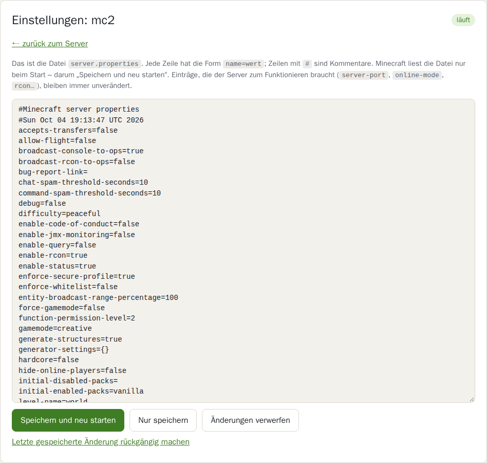

So änderst du etwas:

1. Die Zeile suchen, z. B. `difficulty=easy`.
2. Den Wert hinter dem `=` ändern, z. B. zu `difficulty=hard`.
3. **Speichern und neu starten** klicken (ist der Server aus, heißt der Knopf **Speichern und starten**).

Weitere Knöpfe:

- **Nur speichern** – speichert, startet aber nicht neu. Die Änderung wirkt beim nächsten Start.
- **Änderungen verwerfen** – lädt die Datei neu, ohne zu speichern.
- **Letzte gespeicherte Änderung rückgängig machen** – holt die Fassung von vor deinem letzten Speichern zurück. Praktisch, wenn danach etwas nicht mehr funktioniert.

Ein paar Einträge braucht der Server zum Funktionieren (`server-port`, `online-mode` und alles mit `rcon`). Die bleiben immer gleich, auch wenn du sie änderst.

Unter dem Textfeld steht, was die wichtigsten Einträge bedeuten:

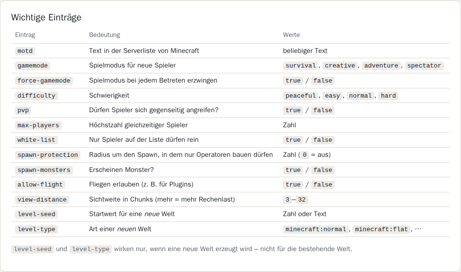

---

## Sicher bleiben

- **Abmelden** (oben rechts), wenn du an einem Schulrechner oder einem fremden Gerät warst. Nach 2 Stunden ohne Aktivität wirst du ohnehin abgemeldet.
- Gib dein **Passwort** und deine **Codes** niemandem – auch nicht Freunden. Freunde fügst du stattdessen als Spieler hinzu.
- Hochgeladene Plugins können alles auf deinem Server tun. Lade nur Plugins hoch, denen du vertraust.

---

## Häufige Fragen

**Der Code kommt nicht an.**
Schau im Spam-Ordner nach. Mit **Neuen Code schicken** kommt ein neuer (höchstens 5 in 15 Minuten). Kommt gar nichts, sag deiner Lehrkraft Bescheid.

**Ich habe mein Passwort vergessen.**
Deine Lehrkraft schickt dir eine neue Einladung. Damit legst du ein neues Passwort fest – das alte gilt dann nicht mehr.

**„Zu viele Fehlversuche. Bitte warte 15 Minuten.“**
Nach zu vielen falschen Passwörtern wird die Anmeldung kurz gesperrt. Nach 15 Minuten geht es wieder.

**„Dir ist im Moment kein Minecraft-Server zugeordnet.“**
Dein Server wurde freigegeben, z. B. weil der Workshop vorbei ist. Frag deine Lehrkraft.

**Mein Server ist „nicht erreichbar“.**
Warte kurz und klicke **Aktualisieren** – nach einem Neustart dauert es etwas. Bleibt es so, sag deiner Lehrkraft Bescheid.

**Ich komme selbst nicht auf meinen Server.**
Läuft der Server („läuft“ oben rechts)? Ist die Spielerliste eingeschaltet, muss auch dein eigener Minecraft-Name darauf stehen.

**Ich habe ein Plugin installiert, aber es tut nichts.**
Den Server **neu starten** – Plugins werden nur beim Start geladen.

**Mein Freund kommt nicht auf den Server.**
- Ist die Spielerliste eingeschaltet? Dann muss er darauf stehen – genau so geschrieben wie im Spiel.
- Hat er eine **ältere** Minecraft-Version als der Server? Dann installiere **ViaBackwards** aus dem Katalog und starte neu. Bei einer **neueren** Version hilft **ViaVersion**.

**Ich habe in den Einstellungen etwas kaputt gemacht.**
In den Einstellungen auf **Letzte gespeicherte Änderung rückgängig machen** klicken und den Server neu starten.

**Ist meine Welt weg, wenn ich den Server stoppe?**
Nein. Beim Stoppen und Neustarten wird die Welt gespeichert.
